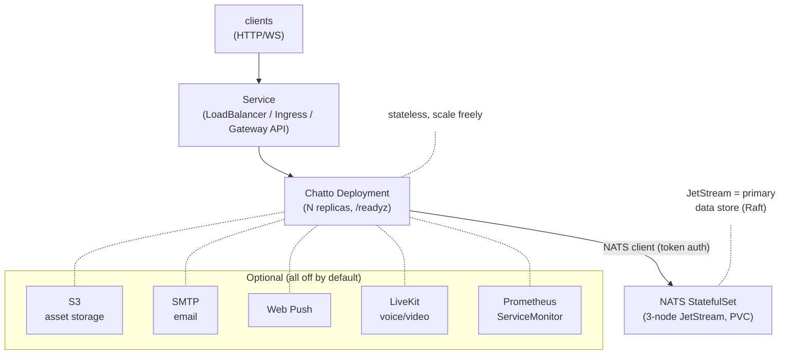

# Chatto Helm Chart

A production-oriented Helm chart for deploying [Chatto](https://github.com/chattocorp/chatto)
— a self-hosted chat application for teams and communities — on Kubernetes.

> **Unofficial / community-maintained.** This is not a Chatto release artifact
> and is not endorsed by the Chatto project. See [NOTICE](NOTICE). The chart is
> Apache-2.0; the Chatto server image it deploys is AGPL-3.0-or-later.

## What it deploys

Chatto is a single Go binary that keeps **all of its state in NATS JetStream**.
Server processes are stateless, so the chart runs them as a scalable
`Deployment` and provisions NATS as the durable, persistent backing store.



`chatto.assets.storageBackend: s3` moves assets off JetStream; the rest are
additive. See [Common configurations](#common-configurations).

## Prerequisites

- Kubernetes 1.23+
- Helm 3.8+ (OCI support)
- A way to reach the Service — a **LoadBalancer controller**, an **Ingress
  controller**, or a **Gateway API controller**
- A **default StorageClass** (a CSI provisioner) — NATS JetStream uses a PVC

This chart targets exactly that baseline: with only a LoadBalancer controller
and a default StorageClass, `helm install` yields a working, clustered chat
server with no other cluster add-ons required.

## Quick start

The chart is published as an OCI artifact on GHCR:

```sh
helm install chatto oci://ghcr.io/luroden/charts/chatto \
  --namespace chatto --create-namespace \
  --set chatto.url=https://chat.example.com \
  --set service.type=LoadBalancer
```

This brings up:

- 2 stateless Chatto replicas (Deployment + PodDisruptionBudget)
- A 3-node NATS JetStream cluster with persistent storage (`CHATTO_NATS_REPLICAS=3`)
- A shared NATS token and all Chatto crypto secrets, **auto-generated** and
  persisted so they survive upgrades

Get the external address and point your DNS `chat.example.com` at it:

```sh
kubectl -n chatto get svc chatto -w
```

### Creating the first user

**A fresh install has no users, and you cannot sign up in the browser until you
have done one of the two things below.** Chatto verifies every registration by
email, so with the chart's default `chatto.smtp.enabled: false` the sign-up form
fails with *"Failed to send email"* and the log shows `SMTP is not enabled`.

**Either** configure SMTP (see below) and register normally, **or** enable the
local Operator API and create the account yourself:

```sh
helm upgrade chatto ... --set chatto.operatorApi.enabled=true

kubectl -n chatto exec -it deploy/chatto -- \
  /chatto operator user create \
    --login admin \
    --verified-email admin@example.com \
    --password-stdin
```

`--verified-email` marks the address as already verified, which is what lets it
bypass SMTP. If that address is listed in `chatto.owners.emails`, the account
comes up with the `owner` role.

The Operator API is a **root-equivalent** Unix socket inside the pod (mode
`0600`; it is never served on the web listener). Anyone who can `exec` into the
pod controls the deployment, so it defaults to off — enable it to bootstrap,
then turn it back off. `/chatto operator user --help` lists the rest
(`list`, `set-password`, `role add`, `delete`).

### TLS

Chatto serves plain HTTP and expects TLS to be terminated in front of it.
Pick one:

- **Gateway API** (recommended where a controller is available): set
  `httpRoute.enabled=true` and either attach to an existing Gateway or let the
  chart own one, with a cert-manager Certificate. Leave `service.type=ClusterIP`.
- **Ingress**: install an ingress controller + cert-manager and set
  `ingress.enabled=true` (see below). Leave `service.type=ClusterIP`.
- **LoadBalancer with built-in Let's Encrypt** (single replica only): Chatto can
  obtain its own certificate via ACME HTTP-01.

  ```sh
  helm install chatto oci://ghcr.io/luroden/charts/chatto -n chatto --create-namespace \
    --set chatto.url=https://chat.example.com \
    --set replicaCount=1 \
    --set service.type=LoadBalancer --set service.port=443 \
    --set chatto.webserver.tls.enabled=true \
    --set chatto.webserver.tls.domain=chat.example.com \
    --set chatto.webserver.tls.email=admin@example.com
  ```

  Built-in TLS does not share certificate state across replicas, so keep
  `replicaCount=1` when using it. For HA, terminate TLS upstream.

## Common configurations

Use a values file for anything beyond a couple of flags:

```sh
helm install chatto oci://ghcr.io/luroden/charts/chatto \
  -n chatto --create-namespace -f my-values.yaml
```

### Gateway API

Needs the Gateway API CRDs (`gateway.networking.k8s.io/v1`) and a controller.
Enable either `httpRoute` or `ingress`, not both. There are two shapes.

**Attach to a Gateway someone else owns.** The usual arrangement when a platform
team runs one shared Gateway and each app brings only a route:

```yaml
httpRoute:
  enabled: true
  parentRefs:
    - name: platform-gateway
      namespace: gateway-system
      sectionName: https-chat # pin to one listener
```

**Let the chart own the Gateway and its certificate.** cert-manager issues the
listener's Secret from an Issuer you already run — the chart never creates one:

```yaml
httpRoute:
  enabled: true # no parentRefs: attaches to the Gateway below
gateway:
  enabled: true
  gatewayClassName: nginx # `kubectl get gatewayclass`
  tls:
    certificate:
      enabled: true
      issuerRef:
        name: letsencrypt-prod
        kind: ClusterIssuer
```

Hostnames default to the host in `chatto.url`; set `httpRoute.hostnames` or
`gateway.hostnames` to override. One listener is generated per hostname.

Unlike Ingress, no annotations are needed to keep WebSockets alive: the chart
defaults `httpRoute.timeouts` to `0s`, which disables the request timeout that
would otherwise sever long-lived connections.

See [`examples/gateway-route-only.yaml`](charts/chatto/examples/gateway-route-only.yaml)
and [`examples/gateway-full.yaml`](charts/chatto/examples/gateway-full.yaml).

### Ingress

```yaml
service:
  type: ClusterIP
ingress:
  enabled: true
  className: nginx
  annotations:
    cert-manager.io/cluster-issuer: letsencrypt-prod
    # Chatto's WebSockets outlive nginx's 60s default.
    nginx.ingress.kubernetes.io/proxy-read-timeout: "3600"
    nginx.ingress.kubernetes.io/proxy-send-timeout: "3600"
  hosts:
    - host: chat.example.com
      paths:
        - path: /
          pathType: Prefix
  tls:
    - secretName: chatto-tls
      hosts: [chat.example.com]
```

### External NATS (bring your own cluster)

```yaml
nats:
  enabled: false
externalNats:
  url: nats://nats-0:4222,nats://nats-1:4222,nats://nats-2:4222
  replicas: 3            # must be odd and match the cluster size
  auth:
    method: token
    token: "<shared token>"   # or use auth.existingSecret
```

### S3 asset storage

```yaml
chatto:
  assets:
    storageBackend: s3
    s3:
      endpoint: https://s3.us-east-1.amazonaws.com
      bucket: chatto-assets
      region: us-east-1
      existingSecret: chatto-s3   # keys: accessKeyId, secretAccessKey
```

### SMTP, Web Push, OIDC login

Without SMTP there is no email verification, so browser registration cannot
complete — see [Creating the first user](#creating-the-first-user).

```yaml
chatto:
  smtp:
    enabled: true
    host: smtp.example.com
    from: noreply@example.com
    existingSecret: chatto-smtp   # keys: username, password
  push:
    enabled: true
    existingSecret: chatto-push   # keys: vapidPublicKey, vapidPrivateKey
    vapidSubject: mailto:admin@example.com
  auth:
    providers:
      - id: company-sso
        type: oidc
        label: Company SSO
        issuerUrl: https://id.example.com/realms/main
        clientId: chatto
        clientSecret: "<secret>"   # stored in the chart Secret
```

### Metrics (Prometheus Operator)

```yaml
chatto:
  metrics:
    enabled: true
serviceMonitor:
  enabled: true
```

### Voice/video (LiveKit)

LiveKit needs UDP media and TURN networking that most clusters don't expose out
of the box, so it is **disabled by default**. You can point Chatto at an
external LiveKit, or enable the bundled subchart and configure its networking:

```yaml
chatto:
  livekit:
    enabled: true
    url: wss://livekit.example.com
    existingSecret: chatto-livekit   # keys: apiKey, apiSecret
livekit:
  enabled: true    # bundle livekit/livekit-server (requires extra networking)
```

## High availability

The defaults are already HA-shaped: 3-node NATS JetStream (tolerates one node
loss), multiple stateless Chatto replicas spread across nodes, a
PodDisruptionBudget, and zero-downtime rolling updates. For larger deployments
raise `nats.config.cluster.replicas` to `5` (keep it odd) and enable
autoscaling:

```yaml
autoscaling:
  enabled: true
  minReplicas: 3
  maxReplicas: 10
```

See the [Chatto HA guide](https://docs.chatto.run/guides/infrastructure/high-availability/).

## Secrets

By default the chart generates stable random keys for
`CHATTO_WEBSERVER_COOKIE_SIGNING_SECRET`, `CHATTO_WEBSERVER_COOKIE_ENCRYPTION_SECRET`,
`CHATTO_CORE_SECRET_KEY`, `CHATTO_CORE_ASSETS_SIGNING_SECRET`, and the NATS token.
They are stored in the release Secret and reused on `helm upgrade`.

For GitOps or reproducible disaster recovery, supply them explicitly under
`secrets.*` / `natsAuth.token`, or bring your own Secret via
`secrets.existingSecret`. **Losing the cookie/core keys invalidates existing
sessions and signed asset URLs**, so back them up.

## Upgrading

```sh
helm dependency build charts/chatto   # if installing from a local checkout
helm upgrade chatto oci://ghcr.io/luroden/charts/chatto -n chatto -f my-values.yaml
```

To move to a new Chatto version, override the image tag (or upgrade to a chart
release whose `appVersion` matches): `--set image.tag=0.4.3`.

## Uninstalling

```sh
helm uninstall chatto -n chatto
```

PersistentVolumeClaims created by the NATS StatefulSet are **not** deleted
automatically — remove them explicitly if you want to discard all data:

```sh
kubectl -n chatto delete pvc -l app.kubernetes.io/name=nats
```

## Configuration reference

Every value is documented inline in
[`charts/chatto/values.yaml`](charts/chatto/values.yaml), and each maps to a
Chatto environment variable documented at
<https://docs.chatto.run/reference/environment-variables/>.

## Contributing

See [CONTRIBUTING.md](CONTRIBUTING.md) and [AGENTS.md](AGENTS.md).
